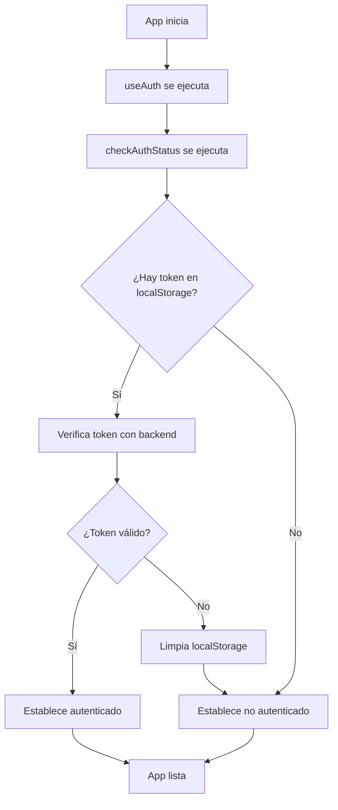
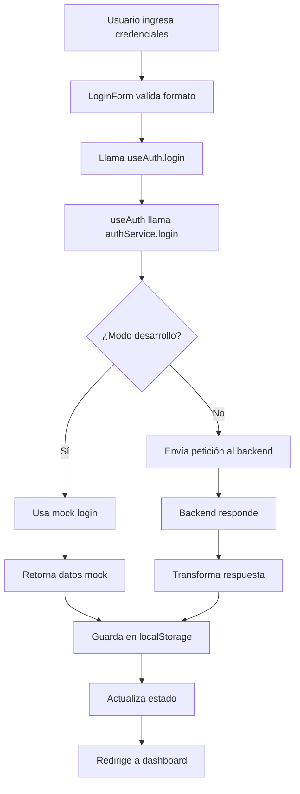
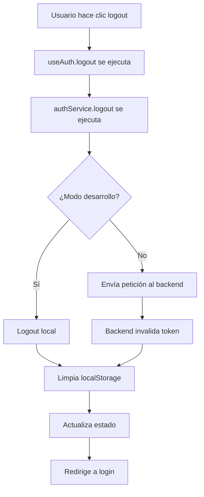

# Sistema de Autenticación Frontend - Documentación Completa

## Índice
1. [Arquitectura del Frontend](#arquitectura-del-frontend)
2. [División de Archivos y Responsabilidades](#división-de-archivos-y-responsabilidades)
3. [Flujo de Autenticación Interno](#flujo-de-autenticación-interno)
4. [Funcionalidades por Componente](#funcionalidades-por-componente)
5. [Configuración y Variables de Entorno](#configuración-y-variables-de-entorno)
6. [Testing y Debugging Frontend](#testing-y-debugging-frontend)

---

## Arquitectura del Frontend

### Visión General
El sistema de autenticación está diseñado para un panel administrativo interno con pocos usuarios (3-4 empleados). La arquitectura es simple pero robusta, separando claramente las responsabilidades entre archivos y componentes.

### Estructura de Archivos
```
src/
├── hooks/
│   └── useAuth.js              # Hook principal de autenticación
├── services/
│   └── authService.js          # Servicio de comunicación con API
├── config/
│   └── auth.js                 # Configuración centralizada
├── components/auth/
│   ├── LoginForm/
│   │   └── LoginForm.jsx       # Formulario de login
│   ├── RequireAuth.jsx         # Protección de rutas
│   └── AuthProvider.jsx        # Proveedor de contexto
└── pages/admin/
    ├── Login/
    │   └── Login.jsx           # Página de login
    └── Dashboard/
        └── Dashboard.jsx        # Panel administrativo
```

### Separación de Responsabilidades

#### **Hooks** (`src/hooks/`)
- **Gestión de estado de autenticación**
- **Lógica de negocio de auth**
- **Persistencia en localStorage**

#### **Services** (`src/services/`)
- **Comunicación con backend**
- **Transformación de datos**
- **Manejo de errores HTTP**

#### **Config** (`src/config/`)
- **Configuración centralizada**
- **Variables de entorno**
- **Endpoints de API**

#### **Components** (`src/components/auth/`)
- **Interfaz de usuario**
- **Protección de rutas**
- **Validación de formularios**

---

## División de Archivos y Responsabilidades

### 1. `src/hooks/useAuth.js` - Hook Principal

#### **¿Qué hace?**
- Gestiona todo el estado de autenticación
- Proporciona funciones de login/logout
- Maneja persistencia en localStorage
- Coordina entre servicios y UI

#### **Estado que maneja:**
```javascript
const [user, setUser] = useState(null)           // Datos del usuario
const [isAuthenticated, setIsAuthenticated] = useState(false)  // Estado de auth
const [isLoading, setIsLoading] = useState(true) // Estado de carga
const [error, setError] = useState(null)         // Errores de auth
```

#### **Funciones principales:**
```javascript
login(credentials)     // Inicia sesión
logout()              // Cierra sesión
checkAuthStatus()     // Verifica estado actual
getToken()            // Obtiene token actual
clearError()          // Limpia errores
```

#### **¿Por qué está aquí?**
- **Centralización**: Toda la lógica de auth en un lugar
- **Reutilización**: Cualquier componente puede usar el hook
- **Consistencia**: Estado sincronizado en toda la app
- **Separación**: UI no maneja lógica de negocio

### 2. `src/services/authService.js` - Servicio de Autenticación

#### **¿Qué hace?**
- Comunica con el backend
- Maneja requests HTTP
- Transforma datos entre frontend y backend
- Proporciona fallback para desarrollo

#### **Funciones principales:**
```javascript
login(credentials)     // POST /api/auth/login
logout()              // POST /api/auth/logout
verifyToken()         // GET /api/auth/verify (opcional)
```

#### **Lógica de desarrollo vs producción:**
```javascript
// Detecta automáticamente el entorno
const isDevelopment = !AUTH_CONFIG.api.baseURL || 
                     AUTH_CONFIG.api.baseURL.includes('localhost:3001')

if (isDevelopment) {
  // Usa mock para desarrollo
  return mockLogin(credentials)
} else {
  // Usa backend real
  return apiRequest(endpoint, options)
}
```

#### **¿Por qué está aquí?**
- **Abstracción**: Componentes no conocen detalles HTTP
- **Testing**: Fácil mockear para tests
- **Mantenimiento**: Cambios en API solo afectan este archivo
- **Flexibilidad**: Fácil cambiar entre desarrollo y producción

### 3. `src/config/auth.js` - Configuración Centralizada

#### **¿Qué hace?**
- Define endpoints de API
- Configura variables de entorno
- Establece timeouts y headers
- Maneja configuración de desarrollo

#### **Configuraciones principales:**
```javascript
api: {
  baseURL: 'http://localhost:3001/api',
  endpoints: { login, logout, verify },
  timeout: 10000
}
storage: {
  tokenKey: 'auth_token',
  userKey: 'auth_user'
}
development: {
  enableMock: true/false
}
```

#### **¿Por qué está aquí?**
- **Una fuente de verdad**: Todas las configuraciones en un lugar
- **Flexibilidad**: Fácil cambiar entre entornos
- **Mantenimiento**: Fácil agregar nuevas configuraciones
- **Claridad**: Todos saben dónde están las configuraciones

### 4. `src/components/auth/LoginForm/LoginForm.jsx` - Formulario de Login

#### **¿Qué hace?**
- Renderiza el formulario de login
- Valida inputs del usuario
- Maneja estados de carga y errores
- Comunica con el hook useAuth

#### **Funcionalidades:**
```javascript
// Validación con React Hook Form
const { register, handleSubmit, formState: { errors } } = useForm()

// Campos del formulario
usuario: string    // Campo de usuario
contraseña: string // Campo de contraseña

// Estados
isSubmitting: boolean  // Estado de carga
errors: object         // Errores de validación
```

#### **¿Por qué está aquí?**
- **Separación de responsabilidades**: UI separada de lógica
- **Reutilización**: Formulario puede usarse en diferentes contextos
- **Testing**: Fácil testear componente de forma aislada
- **Mantenimiento**: Cambios de UI no afectan lógica

### 5. `src/components/auth/RequireAuth.jsx` - Protección de Rutas

#### **¿Qué hace?**
- Protege rutas que requieren autenticación
- Redirige automáticamente a login si no está autenticado
- Muestra loading mientras verifica autenticación

#### **Lógica de protección:**
```javascript
const RequireAuth = ({ children }) => {
  const { isAuthenticated, isLoading } = useAuth()
  
  if (isLoading) {
    return <LoadingSpinner />
  }
  
  if (!isAuthenticated) {
    return <Navigate to="/admin/login" replace />
  }
  
  return children
}
```

#### **¿Por qué está aquí?**
- **Seguridad**: Previene acceso no autorizado
- **UX**: Redirección automática a login
- **Centralización**: Lógica de protección en un lugar
- **Flexibilidad**: Fácil aplicar a diferentes rutas

---

## Flujo de Autenticación Interno

### 1. Inicio de Aplicación



#### **Proceso detallado:**

1. **App se monta** y ejecuta `useAuth()`
2. **Hook ejecuta `checkAuthStatus()`** automáticamente
3. **Verifica localStorage** por token existente
4. **Si hay token**, hace petición de verificación al backend
5. **Backend responde** con validez del token
6. **Hook actualiza estado** según respuesta
7. **App renderiza** según estado de autenticación

### 2. Proceso de Login



#### **Proceso detallado:**

1. **Usuario llena formulario** y hace submit
2. **LoginForm valida** usando React Hook Form
3. **Se llama `useAuth.login()`** con credenciales
4. **Hook llama `authService.login()`**
5. **Service detecta entorno** (desarrollo vs producción)
6. **En desarrollo**: Usa mock login
7. **En producción**: Envía petición al backend
8. **Se guarda token** en localStorage
9. **Estado se actualiza** a autenticado
10. **Usuario es redirigido** al dashboard

### 3. Proceso de Logout



#### **Proceso detallado:**

1. **Usuario hace clic en logout**
2. **Se ejecuta `useAuth.logout()`**
3. **Hook llama `authService.logout()`**
4. **Service detecta entorno**
5. **En desarrollo**: Solo limpia localStorage
6. **En producción**: Envía petición al backend
7. **Se limpia localStorage** independientemente
8. **Estado se actualiza** a no autenticado
9. **Usuario es redirigido** a login

---

## Funcionalidades por Componente

### Hook useAuth - Funcionalidades Principales

#### **Gestión de Estado:**
```javascript
// Estado de autenticación
const [isAuthenticated, setIsAuthenticated] = useState(false)

// Datos del usuario
const [user, setUser] = useState(null)

// Estado de carga
const [isLoading, setIsLoading] = useState(true)

// Errores
const [error, setError] = useState(null)
```

#### **Funciones de Autenticación:**
```javascript
// Login
const login = useCallback(async (credentials) => {
  // Lógica de login
}, [])

// Logout
const logout = useCallback(async () => {
  // Lógica de logout
}, [])

// Verificar estado
const checkAuthStatus = useCallback(async () => {
  // Verificación de token
}, [])

// Obtener token
const getToken = useCallback(() => {
  return localStorage.getItem(AUTH_CONFIG.storage.tokenKey)
}, [])

// Limpiar errores
const clearError = useCallback(() => {
  setError(null)
}, [])
```

### AuthService - Funcionalidades de Comunicación

#### **Detección de Entorno:**
```javascript
// Detecta automáticamente si está en desarrollo
const isDevelopment = !AUTH_CONFIG.api.baseURL || 
                     AUTH_CONFIG.api.baseURL.includes('localhost:3001')

// Usa mock en desarrollo, backend real en producción
if (isDevelopment) {
  return mockLogin(credentials)
} else {
  return apiRequest(endpoint, options)
}
```

#### **Manejo de Errores:**
```javascript
// Diferencia entre errores de red y de autenticación
try {
  const response = await fetch(url, config)
  // Manejo de respuesta
} catch (error) {
  if (error.name === 'TypeError' && error.message.includes('fetch')) {
    throw new Error('Error de conexión con el servidor')
  }
  throw error
}
```

#### **Transformación de Datos:**
```javascript
// Adapta credenciales del frontend al formato del backend
const loginData = {
  email: credentials.usuario,      // Frontend usa 'usuario'
  password: credentials.contraseña // Frontend usa 'contraseña'
}
```

### LoginForm - Funcionalidades de UI

#### **Validación de Formulario:**
```javascript
// Validación con React Hook Form
const { register, handleSubmit, formState: { errors } } = useForm({
  defaultValues: {
    usuario: '',
    contraseña: ''
  }
})

// Validaciones
usuario: {
  required: 'El usuario es requerido'
}
contraseña: {
  required: 'La contraseña es requerida'
}
```

#### **Estados de UI:**
```javascript
// Estado de carga
disabled={isSubmitting}

// Texto dinámico del botón
{isSubmitting ? 'Iniciando sesión...' : 'Iniciar Sesión'}

// Manejo de errores externos
useEffect(() => {
  if (externalErrors) {
    Object.entries(externalErrors).forEach(([field, message]) => {
      setError(field, { type: 'server', message })
    })
  }
}, [externalErrors])
```

### RequireAuth - Funcionalidades de Protección

#### **Lógica de Protección:**
```javascript
const RequireAuth = ({ children }) => {
  const { isAuthenticated, isLoading } = useAuth()
  
  // Muestra loading mientras verifica
  if (isLoading) {
    return <LoadingSpinner />
  }
  
  // Redirige si no está autenticado
  if (!isAuthenticated) {
    return <Navigate to="/admin/login" replace />
  }
  
  // Renderiza contenido protegido
  return children
}
```

#### **Uso en Rutas:**
```javascript
// En el router
<Route 
  path="/admin" 
  element={
    <RequireAuth>
      <Dashboard />
    </RequireAuth>
  } 
/>
```

---

## Configuración y Variables de Entorno

### Variables de Entorno

#### **Archivo `.env`:**
```env
# Para desarrollo (sin backend)
VITE_ENABLE_MOCK=true
VITE_API_URL=http://localhost:3001/api

# Para producción (con backend)
VITE_ENABLE_MOCK=false
VITE_API_URL=https://tu-backend.com/api
```

#### **Configuración en `auth.js`:**
```javascript
export const AUTH_CONFIG = {
  api: {
    baseURL: import.meta.env.VITE_API_URL || 'http://localhost:3001/api',
    endpoints: {
      login: '/auth/login',
      logout: '/auth/logout',
      verify: '/auth/verify'
    },
    timeout: 10000
  },
  storage: {
    tokenKey: 'auth_token',
    userKey: 'auth_user'
  },
  development: {
    enableMock: import.meta.env.VITE_ENABLE_MOCK === 'true' || 
                !import.meta.env.VITE_API_URL
  }
}
```

### Detección Automática de Entorno

#### **Lógica de Detección:**
```javascript
// En authService.js
const isDevelopment = !AUTH_CONFIG.api.baseURL || 
                     AUTH_CONFIG.api.baseURL.includes('localhost:3001')

// En useAuth.js
const isDevelopment = AUTH_CONFIG.development.enableMock
```

#### **¿Por qué funciona así?**
- **Automático**: No necesitas cambiar código manualmente
- **Flexible**: Fácil cambiar entre entornos
- **Seguro**: No expones configuraciones sensibles
- **Mantenible**: Una sola fuente de verdad

---

## Testing y Debugging Frontend

### Testing de Componentes

#### **Testing del Hook useAuth:**
```javascript
// useAuth.test.js
import { renderHook, act } from '@testing-library/react'
import { useAuth } from './useAuth'

test('should login successfully', async () => {
  const { result } = renderHook(() => useAuth())
  
  await act(async () => {
    const response = await result.current.login({
      usuario: 'admin',
      contraseña: 'admin123'
    })
    
    expect(response.success).toBe(true)
    expect(result.current.isAuthenticated).toBe(true)
  })
})

test('should logout successfully', async () => {
  const { result } = renderHook(() => useAuth())
  
  await act(async () => {
    await result.current.logout()
    
    expect(result.current.isAuthenticated).toBe(false)
    expect(result.current.user).toBe(null)
  })
})
```

#### **Testing del AuthService:**
```javascript
// authService.test.js
import { authService } from './authService'

test('should handle login with valid credentials', async () => {
  const response = await authService.login({
    usuario: 'admin',
    contraseña: 'admin123'
  })
  
  expect(response.success).toBe(true)
  expect(response.data.token).toBeDefined()
  expect(response.data.user).toBeDefined()
})

test('should handle login with invalid credentials', async () => {
  const response = await authService.login({
    usuario: 'invalid',
    contraseña: 'invalid'
  })
  
  expect(response.success).toBe(false)
  expect(response.message).toBeDefined()
})
```

#### **Testing del LoginForm:**
```javascript
// LoginForm.test.js
import { render, screen, fireEvent } from '@testing-library/react'
import LoginForm from './LoginForm'

test('should render login form', () => {
  render(<LoginForm onSubmit={jest.fn()} />)
  
  expect(screen.getByLabelText('Usuario')).toBeInTheDocument()
  expect(screen.getByLabelText('Contraseña')).toBeInTheDocument()
  expect(screen.getByRole('button')).toBeInTheDocument()
})

test('should call onSubmit with form data', () => {
  const mockOnSubmit = jest.fn()
  render(<LoginForm onSubmit={mockOnSubmit} />)
  
  fireEvent.change(screen.getByLabelText('Usuario'), {
    target: { value: 'admin' }
  })
  fireEvent.change(screen.getByLabelText('Contraseña'), {
    target: { value: 'admin123' }
  })
  fireEvent.click(screen.getByRole('button'))
  
  expect(mockOnSubmit).toHaveBeenCalledWith({
    usuario: 'admin',
    contraseña: 'admin123'
  })
})
```

### Debugging Frontend

#### **Debugging del Estado de Autenticación:**
```javascript
// En el navegador console
console.log('Auth State:', {
  user: useAuth().user,
  isAuthenticated: useAuth().isAuthenticated,
  isLoading: useAuth().isLoading,
  error: useAuth().error
})

// Verificar localStorage
console.log('LocalStorage:', {
  token: localStorage.getItem('auth_token'),
  user: localStorage.getItem('auth_user')
})
```

#### **Debugging de Requests:**
```javascript
// En authService.js
const apiRequest = async (endpoint, options = {}) => {
  const url = `${AUTH_CONFIG.api.baseURL}${endpoint}`
  
  console.log('Making request to:', url)
  console.log('Request options:', options)
  
  try {
    const response = await fetch(url, config)
    console.log('Response:', response)
    
    const data = await response.json()
    console.log('Response data:', data)
    
    return data
  } catch (error) {
    console.error('Request error:', error)
    throw error
  }
}
```

#### **Debugging de Errores:**
```javascript
// En useAuth.js
const login = useCallback(async (credentials) => {
  try {
    console.log('Login attempt with:', credentials)
    
    const response = await authService.login(credentials)
    console.log('Login response:', response)
    
    if (response.success) {
      console.log('Login successful')
    } else {
      console.log('Login failed:', response.message)
    }
    
    return response
  } catch (error) {
    console.error('Login error:', error)
    throw error
  }
}, [])
```

### Errores Comunes y Soluciones

#### **1. Error de CORS:**
**Síntoma:** `Access to fetch at 'http://localhost:3001/api/auth/login' from origin 'http://localhost:5173' has been blocked by CORS policy`

**Solución:** Verificar que el backend tenga CORS configurado
```javascript
// Backend debe tener
app.use(cors({
  origin: 'http://localhost:5173',
  credentials: true
}))
```

#### **2. Token no válido:**
**Síntoma:** Usuario es redirigido a login aunque tenga token

**Solución:** Verificar formato del token en localStorage
```javascript
// En console del navegador
console.log('Token:', localStorage.getItem('auth_token'))
console.log('User:', localStorage.getItem('auth_user'))
```

#### **3. Error de red:**
**Síntoma:** "Error de conexión con el servidor"

**Solución:** Verificar URL del backend y que esté corriendo
```javascript
// Verificar configuración
console.log('API URL:', AUTH_CONFIG.api.baseURL)
console.log('Endpoints:', AUTH_CONFIG.api.endpoints)
```

### Herramientas de Debugging

#### **Chrome DevTools:**
- **Network tab**: Ver requests HTTP
- **Application tab**: Ver localStorage
- **Console**: Ver logs y errores
- **React DevTools**: Ver estado de componentes

#### **React DevTools:**
- **Profiler**: Ver re-renders
- **Components**: Ver props y estado
- **Hooks**: Ver estado de hooks

#### **Logs del Navegador:**
```javascript
// Agregar logs temporales
console.log('Auth State:', useAuth())
console.log('API Config:', AUTH_CONFIG)
console.log('LocalStorage:', {
  token: localStorage.getItem('auth_token'),
  user: localStorage.getItem('auth_user')
})
```

---

## Resumen de Archivos y Funcionalidades

### **Archivos Principales:**

1. **`src/hooks/useAuth.js`**
   - Gestión de estado de autenticación
   - Funciones de login/logout
   - Persistencia en localStorage

2. **`src/services/authService.js`**
   - Comunicación con backend
   - Detección automática de entorno
   - Manejo de errores HTTP

3. **`src/config/auth.js`**
   - Configuración centralizada
   - Variables de entorno
   - Endpoints de API

4. **`src/components/auth/LoginForm/LoginForm.jsx`**
   - Formulario de login
   - Validación de inputs
   - Estados de UI

5. **`src/components/auth/RequireAuth.jsx`**
   - Protección de rutas
   - Redirección automática
   - Verificación de autenticación

### **Flujo Completo:**

1. **App inicia** → `useAuth` verifica autenticación
2. **Usuario va a `/admin`** → `RequireAuth` protege la ruta
3. **Usuario no autenticado** → Redirige a `/admin/login`
4. **Usuario llena formulario** → `LoginForm` valida y envía
5. **`useAuth.login()`** → Llama `authService.login()`
6. **`authService`** → Detecta entorno y hace request
7. **Respuesta exitosa** → Guarda token y actualiza estado
8. **Usuario autenticado** → Accede al dashboard

### **Ventajas de esta Arquitectura:**

- **Separación clara**: Cada archivo tiene una responsabilidad específica
- **Fácil testing**: Componentes aislados y mockeables
- **Flexibilidad**: Fácil cambiar entre desarrollo y producción
- **Mantenibilidad**: Cambios localizados en archivos específicos
- **Escalabilidad**: Fácil agregar nuevas funcionalidades 