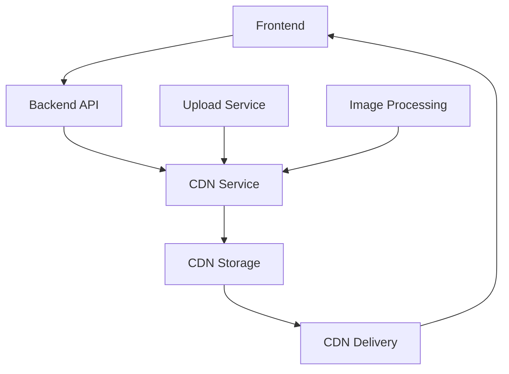

# Integración de CDN con Backend Real

## 🔄 **Flujo Típico de CDN con Backend**

### **1. Flujo Completo**



### **2. Opciones de Implementación**

#### **Opción A: Backend como Intermediario (Recomendado)**

```javascript
// 1. Backend devuelve rutas simples
{
    id: 1,
    marca: "Toyota",
    imagen: "vehicles/toyota-corolla.jpg",
    imagenes: [
        "vehicles/toyota-corolla-1.jpg",
        "vehicles/toyota-corolla-2.jpg"
    ]
}

// 2. Frontend procesa las rutas
const processedVehicle = processVehicleImages(vehicleData, {
    width: 800,
    height: 600,
    quality: 85,
    format: 'webp'
})

// 3. Resultado: URLs optimizadas
{
    id: 1,
    marca: "Toyota",
    imagen: "https://res.cloudinary.com/indiana-usados/image/upload/w_800,h_600,q_85,f_webp,c_fill,fl_progressive/vehicles/toyota-corolla.jpg",
    imagenes: [...]
}
```

#### **Opción B: Backend Devuelve URLs Completas**

```javascript
// Backend devuelve URLs ya procesadas
{
    id: 1,
    marca: "Toyota",
    imagen: "https://res.cloudinary.com/indiana-usados/image/upload/w_800,h_600,q_85,f_webp,c_fill,fl_progressive/vehicles/toyota-corolla.jpg",
    imagenes: [
        "https://res.cloudinary.com/indiana-usados/image/upload/w_800,h_600,q_85,f_webp,c_fill,fl_progressive/vehicles/toyota-corolla-1.jpg",
        "https://res.cloudinary.com/indiana-usados/image/upload/w_800,h_600,q_85,f_webp,c_fill,fl_progressive/vehicles/toyota-corolla-2.jpg"
    ]
}
```

## 🏗️ **Implementación en Backend**

### **1. Estructura de Base de Datos**

```sql
-- Tabla de vehículos
CREATE TABLE vehicles (
    id INT PRIMARY KEY,
    marca VARCHAR(100),
    modelo VARCHAR(100),
    imagen VARCHAR(255), -- Ruta simple: "vehicles/toyota-corolla.jpg"
    imagenes JSON -- Array de rutas: ["vehicles/toyota-corolla-1.jpg", "vehicles/toyota-corolla-2.jpg"]
);

-- Tabla de imágenes (opcional)
CREATE TABLE vehicle_images (
    id INT PRIMARY KEY,
    vehicle_id INT,
    image_path VARCHAR(255),
    image_type ENUM('main', 'gallery'),
    order_index INT
);
```

### **2. API Endpoints**

```javascript
// GET /api/vehicles
// Devuelve lista de vehículos con rutas simples
{
    "data": [
        {
            "id": 1,
            "marca": "Toyota",
            "modelo": "Corolla",
            "imagen": "vehicles/toyota-corolla.jpg",
            "imagenes": [
                "vehicles/toyota-corolla-1.jpg",
                "vehicles/toyota-corolla-2.jpg"
            ]
        }
    ]
}

// GET /api/vehicles/:id
// Devuelve vehículo específico
{
    "id": 1,
    "marca": "Toyota",
    "modelo": "Corolla",
    "imagen": "vehicles/toyota-corolla.jpg",
    "imagenes": [
        "vehicles/toyota-corolla-1.jpg",
        "vehicles/toyota-corolla-2.jpg"
    ]
}
```

### **3. Procesamiento en Backend (Opcional)**

```javascript
// Middleware para procesar imágenes
const processImages = (req, res, next) => {
    const { width, height, quality, format } = req.query
    
    // Procesar imágenes antes de enviar
    if (req.body.imagen) {
        req.body.imagen = generateCdnUrl(req.body.imagen, {
            width: parseInt(width) || 800,
            height: parseInt(height) || 600,
            quality: parseInt(quality) || 85,
            format: format || 'webp'
        })
    }
    
    next()
}

// Uso en rutas
app.get('/api/vehicles', processImages, (req, res) => {
    // Devolver vehículos con imágenes procesadas
})
```

## 🎯 **Implementación en Frontend**

### **1. Servicio de Imágenes**

```javascript
// src/services/imageService.js
export const processVehicleImages = (vehicleData, options = {}) => {
    const {
        width = 800,
        height = 600,
        quality = 85,
        format = 'webp'
    } = options

    // Procesar imagen principal
    const imagen = processImageUrl(vehicleData.imagen, { width, height, quality, format })
    
    // Procesar array de imágenes
    const imagenes = vehicleData.imagenes?.map(img => 
        processImageUrl(img, { width, height, quality, format })
    ) || []

    return {
        ...vehicleData,
        imagen,
        imagenes
    }
}
```

### **2. Hook para Procesar Datos**

```javascript
// src/hooks/useVehicleData.js
import { processVehicleImages } from '../services/imageService'

export const useVehicleData = (vehicleData, options = {}) => {
    const processedData = useMemo(() => {
        return processVehicleImages(vehicleData, options)
    }, [vehicleData, options])

    return processedData
}
```

### **3. Uso en Componentes**

```javascript
// En CardAuto.jsx
const CardAuto = ({ auto }) => {
    const processedAuto = useVehicleData(auto, {
        width: 400,
        height: 300,
        quality: 85,
        format: 'webp'
    })

    return (
        <div className={styles.card}>
            
        </div>
    )
}
```

## 📊 **Ejemplos de CDNs**

### **1. Cloudinary**

```javascript
// Configuración
const CLOUDINARY_CONFIG = {
    cloudName: 'indiana-usados',
    baseUrl: 'https://res.cloudinary.com/indiana-usados/image/upload'
}

// Generar URL
const generateCloudinaryUrl = (imagePath, options = {}) => {
    const { width, height, quality = 85, format = 'webp' } = options
    
    const transformations = []
    if (width) transformations.push(`w_${width}`)
    if (height) transformations.push(`h_${height}`)
    if (quality) transformations.push(`q_${quality}`)
    if (format) transformations.push(`f_${format}`)
    
    transformations.push('c_fill', 'fl_progressive')
    
    const transformationString = transformations.join(',')
    return `${CLOUDINARY_CONFIG.baseUrl}/${transformationString}/${imagePath}`
}

// Uso
const url = generateCloudinaryUrl('vehicles/toyota-corolla.jpg', {
    width: 800,
    height: 600,
    quality: 85,
    format: 'webp'
})
// Resultado: https://res.cloudinary.com/indiana-usados/image/upload/w_800,h_600,q_85,f_webp,c_fill,fl_progressive/vehicles/toyota-corolla.jpg
```

### **2. AWS CloudFront**

```javascript
// Configuración
const CLOUDFRONT_CONFIG = {
    domain: 'd1234567890.cloudfront.net',
    baseUrl: 'https://d1234567890.cloudfront.net'
}

// Generar URL
const generateCloudFrontUrl = (imagePath, options = {}) => {
    const { width, height, quality = 85, format = 'webp' } = options
    
    const params = new URLSearchParams()
    if (width) params.set('w', width)
    if (height) params.set('h', height)
    if (quality) params.set('q', quality)
    if (format) params.set('f', format)
    
    return `${CLOUDFRONT_CONFIG.baseUrl}/${imagePath}?${params.toString()}`
}
```

### **3. Imgix**

```javascript
// Configuración
const IMGIX_CONFIG = {
    domain: 'indiana-usados.imgix.net',
    baseUrl: 'https://indiana-usados.imgix.net'
}

// Generar URL
const generateImgixUrl = (imagePath, options = {}) => {
    const { width, height, quality = 85, format = 'webp' } = options
    
    const params = new URLSearchParams()
    if (width) params.set('w', width)
    if (height) params.set('h', height)
    if (quality) params.set('q', quality)
    if (format) params.set('fm', format)
    
    return `${IMGIX_CONFIG.baseUrl}/${imagePath}?${params.toString()}`
}
```

## 🔧 **Configuración de Variables de Entorno**

```bash
# .env.development
VITE_ENVIRONMENT=development
VITE_USE_CDN=false
VITE_CLOUDINARY_CLOUD_NAME=indiana-usados-dev

# .env.production
VITE_ENVIRONMENT=production
VITE_USE_CDN=true
VITE_CLOUDINARY_CLOUD_NAME=indiana-usados-prod
VITE_CLOUDINARY_API_KEY=your_api_key
VITE_CLOUDINARY_API_SECRET=your_api_secret
```

## 📈 **Ventajas de esta Implementación**

1. **Flexibilidad**: Funciona con cualquier CDN
2. **Escalabilidad**: Fácil cambio entre CDNs
3. **Optimización**: Transformaciones automáticas
4. **Fallback**: Funciona sin CDN en desarrollo
5. **Mantenibilidad**: Configuración centralizada

## 🚀 **Próximos Pasos**

1. **Configurar CDN** (Cloudinary, AWS CloudFront, etc.)
2. **Subir imágenes** al CDN
3. **Actualizar backend** para devolver rutas simples
4. **Implementar procesamiento** en frontend
5. **Monitorear rendimiento** y optimizar

Esta implementación te permite migrar gradualmente de imágenes locales a CDN sin afectar la funcionalidad existente. 