# 🏗️ **Guía Completa de Arquitectura - Sistema de Filtros**

## 📋 **Índice**

1. [Visión General](#visión-general)
2. [Diagrama de Flujos](#diagrama-de-flujos)
3. [Diagrama de Responsabilidades](#diagrama-de-responsabilidades)
4. [Diagrama de Datos](#diagrama-de-datos)
5. [Arquitectura de Componentes](#arquitectura-de-componentes)
6. [Sistema de Cache](#sistema-de-cache)
7. [Flujo de Trabajo Detallado](#flujo-de-trabajo-detallado)
8. [Configuración para Backend Real](#configuración-para-backend-real)
9. [Testing y Debugging](#testing-y-debugging)
10. [Optimizaciones y Mejoras](#optimizaciones-y-mejoras)

---

## 🎯 **Visión General**

### **Objetivo del Sistema:**
Crear un sistema de filtros robusto, escalable y con excelente UX que permita:
- Configurar filtros de forma interactiva
- Aplicar filtros via peticiones POST al backend
- Mantener cache inteligente de datos
- Proporcionar feedback visual completo
- Escalar para grandes datasets

### **Principios de Diseño:**
- ✅ **Separación de responsabilidades**
- ✅ **Cache inteligente con React Query**
- ✅ **UX fluida con estados claros**
- ✅ **Arquitectura preparada para backend real**
- ✅ **Código modular y mantenible**

---

## 🔄 **Diagrama de Flujos**

### **Flujo Principal - Aplicación de Filtros**

```mermaid
graph TD
    A[Usuario configura filtros] --> B[handleFiltersChange]
    B --> C[pendingFilters se actualiza]
    C --> D[FilterSummary muestra filtros pendientes]
    D --> E[Usuario hace clic en 'Aplicar']
    E --> F[applyFilters se ejecuta]
    F --> G[Validar filtros]
    G --> H[Transformar filtros para backend]
    H --> I[useMutation ejecuta POST]
    I --> J[Backend procesa filtros]
    J --> K[Respuesta del backend]
    K --> L[onSuccess se ejecuta]
    L --> M[Actualizar currentFilters]
    M --> N[Invalidar cache principal]
    N --> O[Actualizar cache de filtrados]
    O --> P[Mostrar notificación de éxito]
    P --> Q[UI se actualiza con resultados]
    
    style A fill:#e1f5fe
    style E fill:#fff3e0
    style I fill:#f3e5f5
    style Q fill:#e8f5e8
```



### **Flujo de Cache y Datos**


### **Flujo de Estados de Filtros**


---

## 🏛️ **Diagrama de Responsabilidades**

### **Arquitectura de Capas**


### **Responsabilidades por Componente**

| Componente | Responsabilidad | Dependencias |
|------------|----------------|--------------|
| **FilterForm** | Capturar filtros del usuario | useFilterSystem |
| **FilterSummary** | Mostrar filtros pendientes/aplicados | pendingFilters, currentFilters |
| **ListAutos** | Renderizar lista de vehículos | useFilterSystem, cars |
| **useFilterSystem** | Orquestar lógica de filtros | useMutation, useQuery |
| **useGetCars** | Obtener y cachear datos | autoService, React Query |
| **autoService** | Comunicación con backend | Mock data / Real API |
| **FilterContext** | Proporcionar estado global | useFilterSystem |

---

## 📊 **Diagrama de Datos**

### **Estructura de Datos**


### **Flujo de Transformación de Datos**

```mermaid
graph LR
    A[Filtros Frontend] --> B[Transformación]
    B --> C[Filtros Backend]
    C --> D[Petición POST]
    D --> E[Respuesta Backend]
    E --> F[Datos Filtrados]
    F --> G[Cache React Query]
    G --> H[UI Actualizada]
    
    subgraph "Transformación"
        B1[marca → brand]
        B2[añoDesde → yearFrom]
        B3[precioHasta → priceTo]
        B4[combustible → fuel]
    end
    
    B --> B1
    B --> B2
    B --> B3
    B --> B4
    
    style A fill:#e1f5fe
    style C fill:#fff3e0
    style F fill:#f3e5f5
    style H fill:#e8f5e8
```



### **Estructura de Cache**

```mermaid
graph TD
    A[React Query Cache] --> B[all-vehicles]
    A --> C[filtered-vehicles]
    
    B --> D[items: Array]
    B --> E[total: Number]
    B --> F[timestamp: String]
    
    C --> G[filtered-vehicles, {marca: "Toyota"}]
    C --> H[filtered-vehicles, {año: "2020"}]
    C --> I[filtered-vehicles, {marca: "Toyota", año: "2020"}]
    
    G --> J[items: Array]
    G --> K[filteredCount: Number]
    G --> L[totalCount: Number]
    G --> M[filters: Object]
    
    style A fill:#e3f2fd
    style B fill:#f3e5f5
    style C fill:#e8f5e8
```

---

## 🧩 **Arquitectura de Componentes**

### **Jerarquía de Componentes**

```
App
├── FilterContext
│   └── FilterProvider
│       └── useFilterSystem
│           ├── useGetCars
│           ├── useMutation
│           └── useFilterNotifications
├── ListAutos
│   ├── FilterForm
│   ├── FilterSummary
│   ├── AutosGrid
│   └── CardAuto
└── Pages
    ├── Home
    ├── Vehiculos
    └── VehiculoDetalle
```

### **Comunicación entre Componentes**


---

## 💾 **Sistema de Cache**

### **Estrategia de Cache**


### **Configuración de Cache por Query**

| Query Key | Stale Time | Cache Time | Propósito |
|-----------|------------|------------|-----------|
| `['all-vehicles']` | 10 minutos | 1 hora | Lista completa |
| `['filtered-vehicles', filters]` | 5 minutos | 30 minutos | Resultados filtrados |
| `['auto', id]` | 5 minutos | 30 minutos | Detalle de vehículo |

---

## 🔄 **Flujo de Trabajo Detallado**

### **Paso 1: Configuración de Filtros**

```javascript
// 1. Usuario interactúa con FilterForm
const handleFiltersChange = (filters) => {
    setPendingFilters(filters) // Actualiza estado local
}

// 2. FilterSummary se actualiza automáticamente
// 3. UI muestra filtros pendientes
```

### **Paso 2: Validación y Transformación**

```javascript
// 1. Validar filtros
const validFilters = Object.entries(pendingFilters).reduce((acc, [key, value]) => {
    if (value && value !== '' && value !== null && value !== undefined) {
        acc[key] = value
    }
    return acc
}, {})

// 2. Transformar para backend
const transformFiltersToQueryParams = (filters) => {
    const validFilters = {}
    Object.entries(filters).forEach(([key, value]) => {
        switch (key) {
            case 'marca':
                validFilters.brand = value
                break
            case 'añoDesde':
                validFilters.yearFrom = parseInt(value)
                break
            // ... más transformaciones
        }
    })
    return validFilters
}
```

### **Paso 3: Petición al Backend**

```javascript
// 1. Ejecutar mutation
const applyFiltersMutation = useMutation({
    mutationFn: async (filters) => {
        const queryParams = transformFiltersToQueryParams(filters)
        return await autoService.applyFilters(queryParams)
    },
    onSuccess: (result) => {
        // Actualizar estado
        setCurrentFilters(pendingFilters)
        
        // Invalidar cache
        queryClient.invalidateQueries({ queryKey: ['all-vehicles'] })
        
        // Actualizar cache de filtrados
        queryClient.setQueryData(['filtered-vehicles', pendingFilters], result)
        
        // Mostrar notificación
        notifications.showSuccessNotification(
            `Filtros aplicados correctamente. ${result.filteredCount} de ${result.totalCount} vehículos encontrados.`
        )
    }
})
```

### **Paso 4: Actualización de UI**

```javascript
// 1. Query de datos filtrados se ejecuta automáticamente
const {
    data: filteredData,
    isLoading: isLoadingFiltered
} = useQuery({
    queryKey: ['filtered-vehicles', currentFilters],
    queryFn: () => autoService.applyFilters(currentFilters),
    enabled: Object.keys(currentFilters).length > 0
})

// 2. UI se actualiza con nuevos datos
const cars = useMemo(() => {
    if (Object.keys(currentFilters).length > 0 && filteredData) {
        return filteredData.items || []
    }
    return allCars
}, [currentFilters, filteredData, allCars])
```

---

## 🔧 **Configuración para Backend Real**

### **Variables de Entorno**

```bash
# .env
REACT_APP_API_BASE_URL=https://tu-backend.com/api
REACT_APP_API_KEY=tu-api-key-aqui
REACT_APP_ENVIRONMENT=production
```

### **Configuración del Servicio**

```javascript
// src/services/service.jsx
const API_BASE_URL = process.env.REACT_APP_API_BASE_URL
const API_KEY = process.env.REACT_APP_API_KEY

const applyFilters = async (filters) => {
    const response = await fetch(`${API_BASE_URL}/vehicles/filter`, {
        method: 'POST',
        headers: {
            'Content-Type': 'application/json',
            'Authorization': `Bearer ${API_KEY}`,
            'Accept': 'application/json'
        },
        body: JSON.stringify(filters)
    })
    
    if (!response.ok) {
        const errorData = await response.json().catch(() => ({}))
        throw new Error(errorData.message || `HTTP error! status: ${response.status}`)
    }
    
    return response.json()
}

const getAllVehicles = async () => {
    const response = await fetch(`${API_BASE_URL}/vehicles`, {
        headers: {
            'Authorization': `Bearer ${API_KEY}`,
            'Accept': 'application/json'
        }
    })
    
    if (!response.ok) {
        throw new Error(`HTTP error! status: ${response.status}`)
    }
    
    return response.json()
}
```

### **Endpoints del Backend**

```javascript
// Backend (Node.js/Express ejemplo)
app.get('/api/vehicles', authenticateToken, async (req, res) => {
    try {
        const vehicles = await Vehicle.find({})
        res.json({
            items: vehicles,
            total: vehicles.length,
            timestamp: new Date().toISOString()
        })
    } catch (error) {
        res.status(500).json({ message: 'Error al obtener vehículos' })
    }
})

app.post('/api/vehicles/filter', authenticateToken, async (req, res) => {
    try {
        const filters = req.body
        const query = buildFilterQuery(filters)
        
        const filteredVehicles = await Vehicle.find(query)
        const totalVehicles = await Vehicle.countDocuments({})
        
        res.json({
            items: filteredVehicles,
            total: filteredVehicles.length,
            filteredCount: filteredVehicles.length,
            totalCount: totalVehicles,
            filters: filters,
            timestamp: new Date().toISOString()
        })
    } catch (error) {
        res.status(500).json({ message: 'Error al filtrar vehículos' })
    }
})

function buildFilterQuery(filters) {
    const query = {}
    
    if (filters.brand) {
        query.brand = { $regex: filters.brand, $options: 'i' }
    }
    
    if (filters.yearFrom || filters.yearTo) {
        query.year = {}
        if (filters.yearFrom) query.year.$gte = filters.yearFrom
        if (filters.yearTo) query.year.$lte = filters.yearTo
    }
    
    if (filters.priceFrom || filters.priceTo) {
        query.price = {}
        if (filters.priceFrom) query.price.$gte = filters.priceFrom
        if (filters.priceTo) query.price.$lte = filters.priceTo
    }
    
    return query
}
```

---

## 🧪 **Testing y Debugging**

### **Testing de Componentes**

```javascript
// src/tests/useFilterSystem.test.js
import { renderHook, act } from '@testing-library/react'
import { useFilterSystem } from '../hooks/filters/useFilterSystem'

describe('useFilterSystem', () => {
    test('should handle filter changes', () => {
        const { result } = renderHook(() => useFilterSystem())
        
        act(() => {
            result.current.handleFiltersChange({ marca: 'Toyota' })
        })
        
        expect(result.current.pendingFilters).toEqual({ marca: 'Toyota' })
    })
    
    test('should apply filters successfully', async () => {
        const { result } = renderHook(() => useFilterSystem())
        
        act(() => {
            result.current.handleFiltersChange({ marca: 'Toyota' })
        })
        
        await act(async () => {
            await result.current.applyFilters()
        })
        
        expect(result.current.currentFilters).toEqual({ marca: 'Toyota' })
    })
})
```

### **Debugging en Consola**

```javascript
// Funciones de debug disponibles
console.log('Pending filters:', pendingFilters)
console.log('Current filters:', currentFilters)
console.log('Filtered data:', filteredData)
console.log('All vehicles:', allVehicles)

// Verificar cache
console.log('Cache all-vehicles:', queryClient.getQueryData(['all-vehicles']))
console.log('Cache filtered:', queryClient.getQueryData(['filtered-vehicles', currentFilters]))

// Probar transformación
console.log('Transformed filters:', transformFiltersToQueryParams({
    marca: "Toyota",
    añoDesde: "2020",
    precioHasta: "50000"
}))
```

### **Herramientas de Desarrollo**

```javascript
// React Query DevTools (en desarrollo)
import { ReactQueryDevtools } from '@tanstack/react-query-devtools'

function App() {
    return (
        <>
            {/* Tu app aquí */}
            <ReactQueryDevtools initialIsOpen={false} />
        </>
    )
}
```

---

## ⚡ **Optimizaciones y Mejoras**

### **Optimizaciones de Performance**

1. **Debounce en filtros:**
```javascript
const debouncedHandleFiltersChange = useMemo(
    () => debounce(handleFiltersChange, 300),
    [handleFiltersChange]
)
```

2. **Memoización de componentes:**
```javascript
const MemoizedFilterSummary = memo(FilterSummary)
const MemoizedCardAuto = memo(CardAuto)
```

3. **Lazy loading de imágenes:**
```javascript
const LazyImage = ({ src, alt }) => {
    const [isLoaded, setIsLoaded] = useState(false)
    
    return (
         setIsLoaded(true)}
            className={isLoaded ? 'loaded' : 'loading'}
        />
    )
}
```

### **Mejoras de UX**

1. **Estados de carga más granulares:**
```javascript
const loadingStates = {
    initial: isLoadingAll,
    filtering: isFiltering,
    filtered: isLoadingFiltered,
    error: isError
}
```

2. **Notificaciones más informativas:**
```javascript
const getNotificationMessage = (filteredCount, totalCount) => {
    if (filteredCount === 0) {
        return 'No se encontraron vehículos con los filtros aplicados.'
    }
    if (filteredCount === totalCount) {
        return 'Mostrando todos los vehículos disponibles.'
    }
    return `Se encontraron ${filteredCount} de ${totalCount} vehículos.`
}
```

3. **Persistencia de filtros:**
```javascript
// Guardar filtros en localStorage
useEffect(() => {
    localStorage.setItem('savedFilters', JSON.stringify(currentFilters))
}, [currentFilters])

// Recuperar filtros al cargar
useEffect(() => {
    const saved = localStorage.getItem('savedFilters')
    if (saved) {
        setCurrentFilters(JSON.parse(saved))
    }
}, [])
```

### **Escalabilidad**

1. **Paginación infinita:**
```javascript
const {
    data,
    fetchNextPage,
    hasNextPage,
    isFetchingNextPage
} = useInfiniteQuery({
    queryKey: ['filtered-vehicles', currentFilters],
    queryFn: ({ pageParam = 1 }) => 
        autoService.applyFilters(currentFilters, pageParam),
    getNextPageParam: (lastPage) => lastPage.nextPage
})
```

2. **Filtros dinámicos:**
```javascript
const dynamicFilters = {
    // Filtros que se cargan desde el backend
    marcas: await getMarcas(),
    años: await getAños(),
    precios: await getPrecios()
}
```

3. **Búsqueda en tiempo real:**
```javascript
const searchQuery = useQuery({
    queryKey: ['search', searchTerm],
    queryFn: () => autoService.search(searchTerm),
    enabled: searchTerm.length > 2,
    staleTime: 1000 * 60 * 1 // 1 minuto
})
```

---

## 🎯 **Conclusión**

Esta arquitectura proporciona:

### **✅ Ventajas Técnicas:**
- **Separación clara** de responsabilidades
- **Cache inteligente** con React Query
- **Performance optimizada** con memoización
- **Escalabilidad** para grandes datasets
- **Mantenibilidad** con código modular

### **✅ Ventajas de UX:**
- **Feedback inmediato** al configurar filtros
- **Estados de carga claros**
- **Notificaciones informativas**
- **Navegación fluida** entre filtros
- **Datos consistentes** en toda la app

### **✅ Preparación para Producción:**
- **Configuración flexible** para backend real
- **Manejo robusto** de errores
- **Testing completo** de componentes
- **Debugging avanzado** con herramientas
- **Optimizaciones** de performance

¡Arquitectura robusta, escalable y lista para producción! 