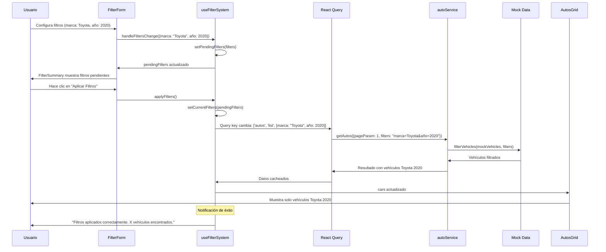
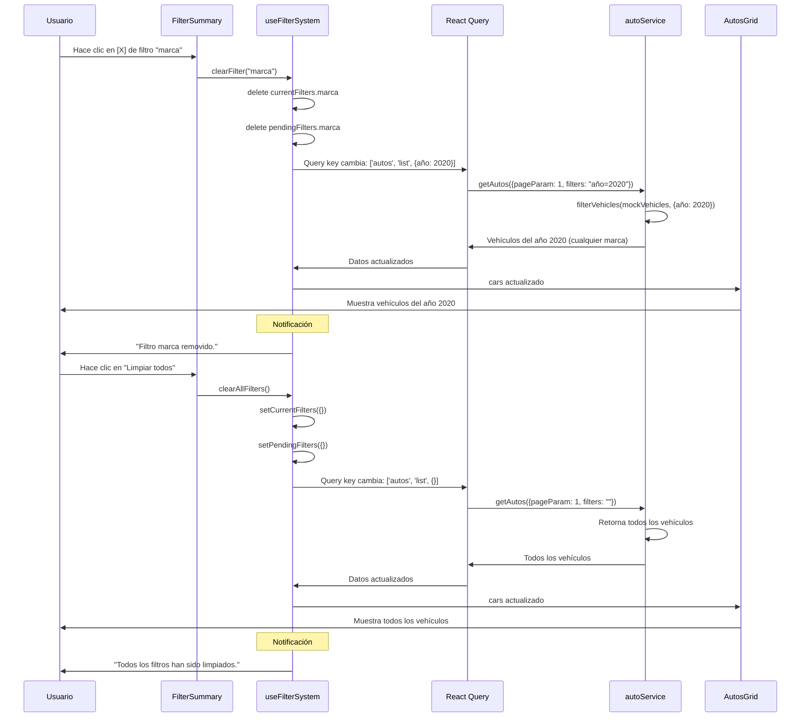
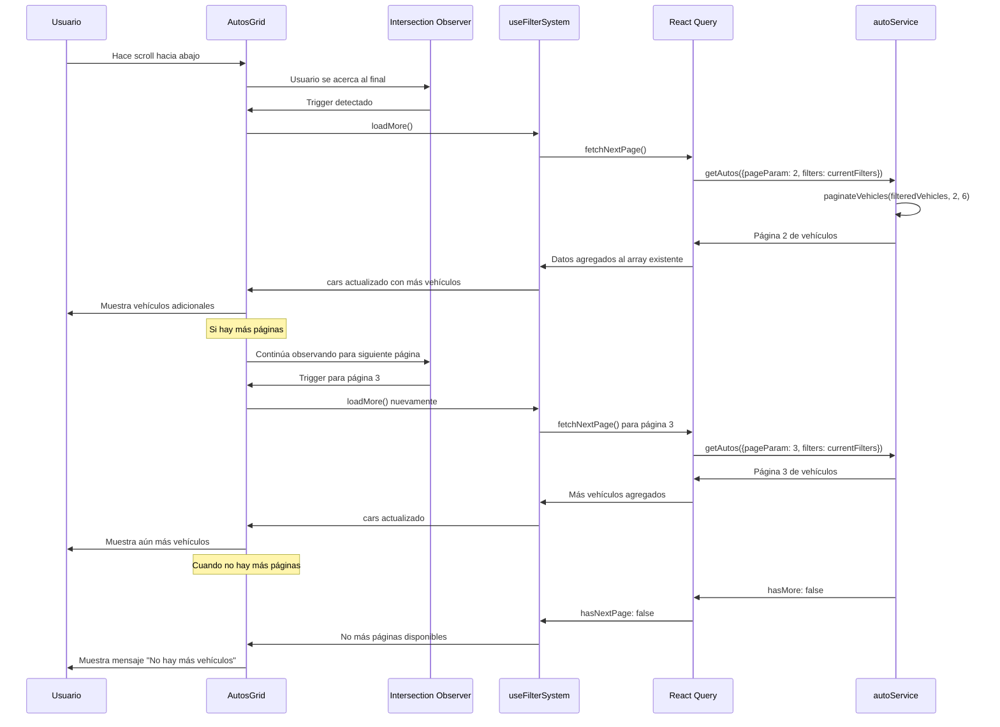
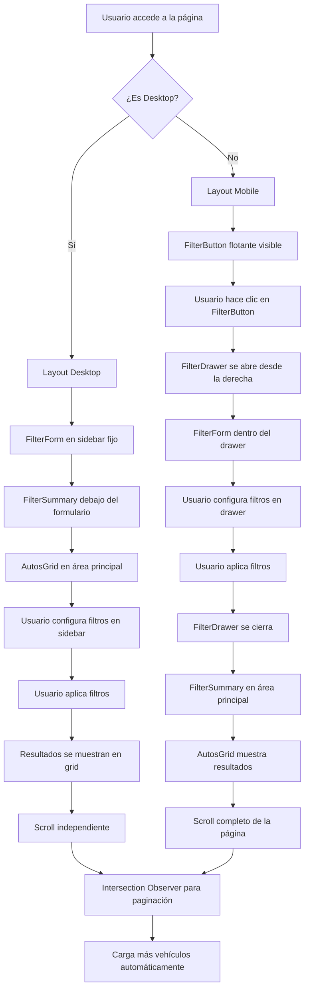
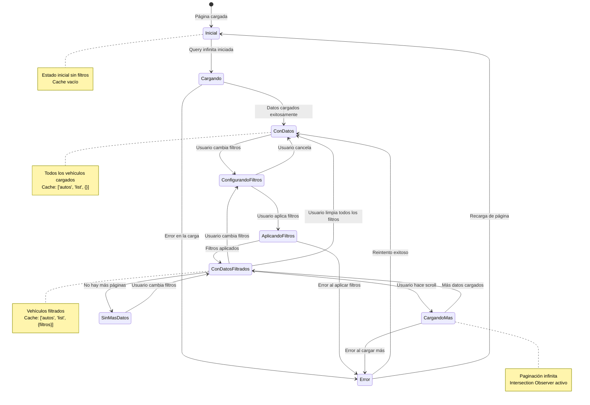
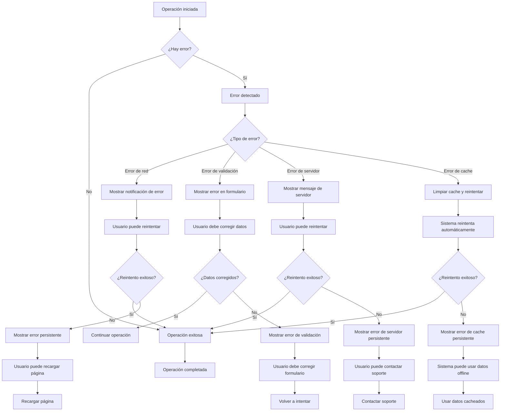
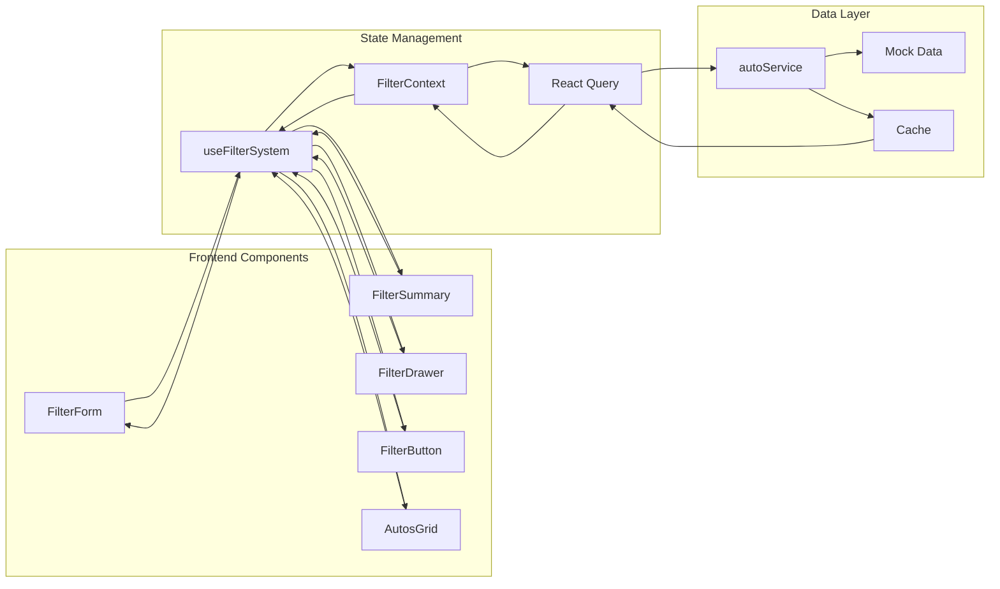
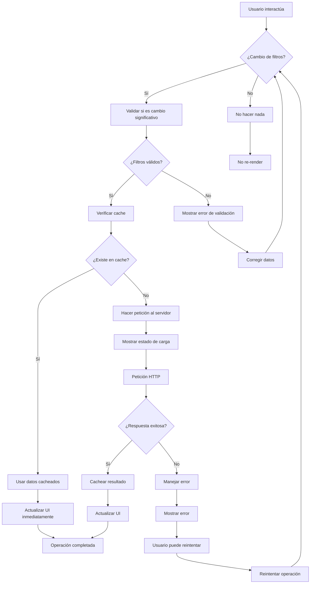
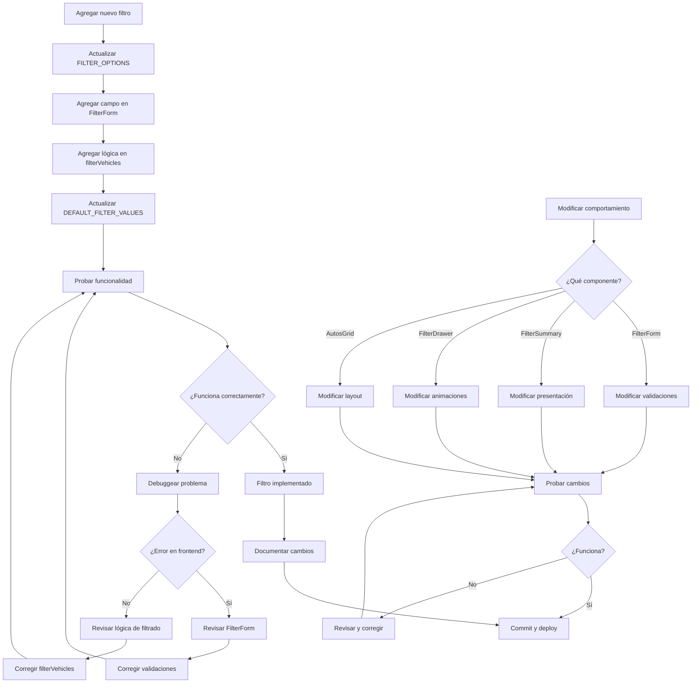

# 🔄 **Diagramas de Flujo - Sistema de Filtrado Indiana Usados**

## 📋 **Índice de Diagramas**

1. **Flujo Principal del Sistema**
2. **Flujo de Aplicación de Filtros**
3. **Flujo de Limpieza de Filtros**
4. **Flujo de Paginación Infinita**
5. **Flujo Responsive (Desktop vs Mobile)**
6. **Flujo de Estados y Cache**
7. **Flujo de Manejo de Errores**

---

## 🏗️ **1. Flujo Principal del Sistema**

```mermaid
graph TD
    A[Usuario entra a la página] --> B[FilterProvider se inicializa]
    B --> C[useFilterSystem se ejecuta]
    C --> D[Estado inicial: currentFilters = {}]
    D --> E[Query infinita se ejecuta]
    E --> F[autoService.getAutos() sin filtros]
    F --> G[Mock data retorna todos los vehículos]
    G --> H[React Query cachea resultado]
    H --> I[UI muestra todos los vehículos]
    
    I --> J[Usuario interactúa con filtros]
    J --> K{¿Es Desktop?}
    K -->|Sí| L[FilterForm en sidebar]
    K -->|No| M[FilterButton flotante]
    
    L --> N[Usuario configura filtros]
    M --> O[Usuario hace clic en FilterButton]
    O --> P[FilterDrawer se abre]
    P --> N
    
    N --> Q[handleFiltersChange() actualiza pendingFilters]
    Q --> R[FilterSummary muestra filtros pendientes]
    R --> S[Usuario hace clic en "Aplicar Filtros"]
    S --> T[applyFilters() se ejecuta]
    T --> U[currentFilters = pendingFilters]
    U --> V[Query infinita detecta cambio]
    V --> W[autoService.getAutos() con filtros]
    W --> X[Mock data filtra vehículos]
    X --> Y[React Query cachea resultado]
    Y --> Z[UI muestra vehículos filtrados]
    
    Z --> AA[Usuario hace scroll]
    AA --> BB[Intersection Observer detecta final]
    BB --> CC[loadMore() se ejecuta]
    CC --> DD[fetchNextPage() carga más vehículos]
    DD --> EE[Vehículos se agregan al array]
    EE --> Z
```

---

## 🎯 **2. Flujo de Aplicación de Filtros**



---

## 🧹 **3. Flujo de Limpieza de Filtros**



---

## 📄 **4. Flujo de Paginación Infinita**



---

## 📱 **5. Flujo Responsive (Desktop vs Mobile)**



---

## 🔄 **6. Flujo de Estados y Cache**



---

## ⚠️ **7. Flujo de Manejo de Errores**



---

## 🎯 **8. Flujo de Datos Completo**



---

## 📊 **9. Flujo de Performance y Optimizaciones**



---

## 🔧 **10. Flujo de Desarrollo y Mantenimiento**



---

## 📝 **Resumen de Flujos**

### **Flujos Principales:**
1. **Inicialización**: Sistema se carga sin filtros
2. **Configuración**: Usuario configura filtros pendientes
3. **Aplicación**: Filtros se aplican y datos se actualizan
4. **Limpieza**: Filtros se remueven individual o masivamente
5. **Paginación**: Carga automática de más datos al hacer scroll

### **Flujos de Error:**
1. **Validación**: Errores en formulario
2. **Red**: Errores de conexión
3. **Servidor**: Errores del backend
4. **Cache**: Errores de datos cacheados

### **Flujos de Performance:**
1. **Cache**: Uso inteligente de React Query
2. **Memoización**: Evitar re-renders innecesarios
3. **Lazy Loading**: Carga progresiva de datos
4. **Optimización**: Intersection Observer para scroll

### **Flujos Responsive:**
1. **Desktop**: Sidebar fijo con formulario
2. **Mobile**: Drawer lateral con botón flotante
3. **Adaptación**: Componentes se adaptan al dispositivo

Estos diagramas proporcionan una **visión completa y detallada** de cómo funciona el sistema de filtrado de Indiana Usados, facilitando el entendimiento, desarrollo y mantenimiento del sistema. 