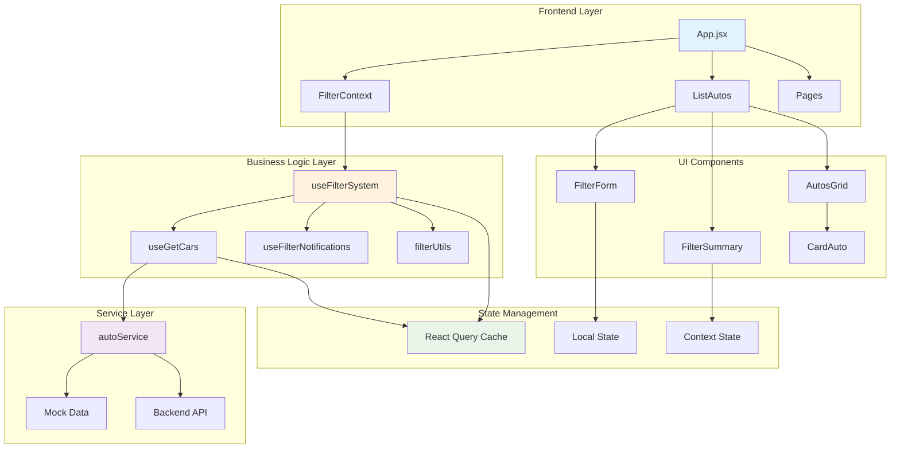
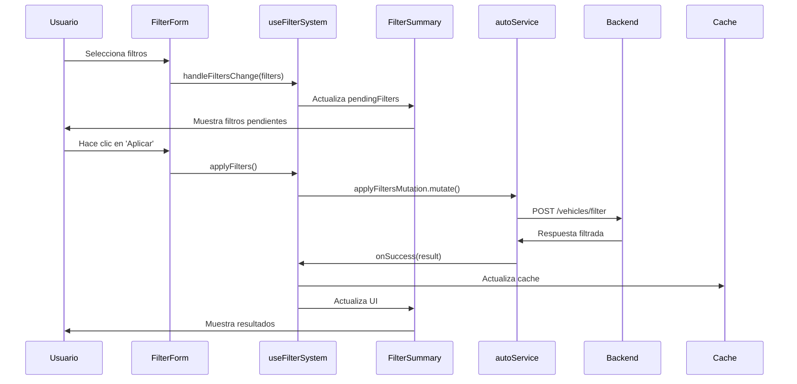
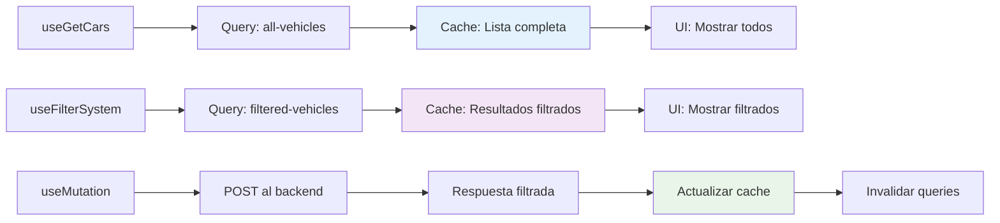
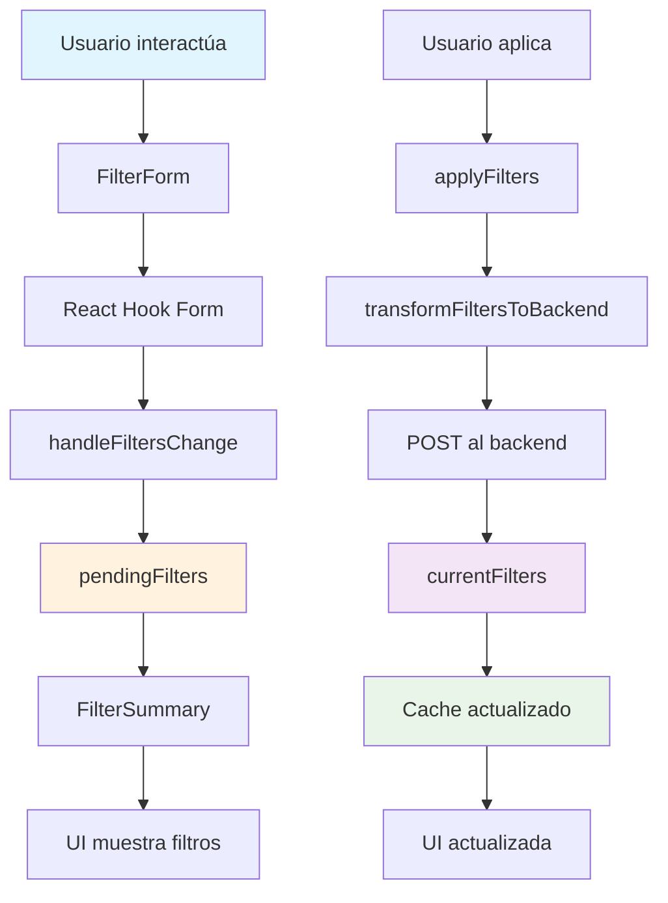
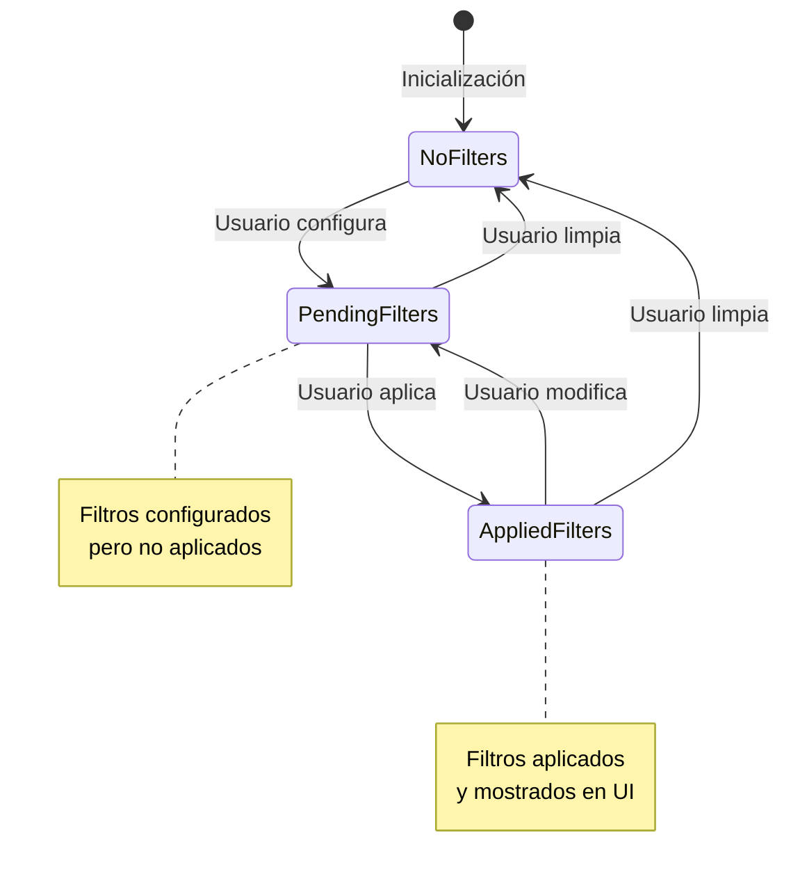
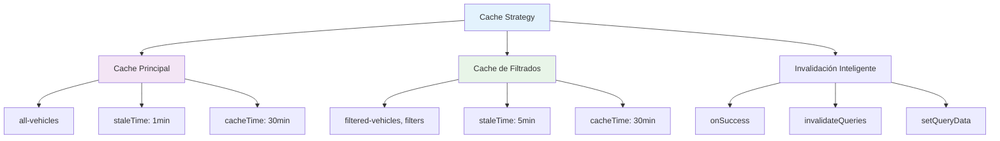
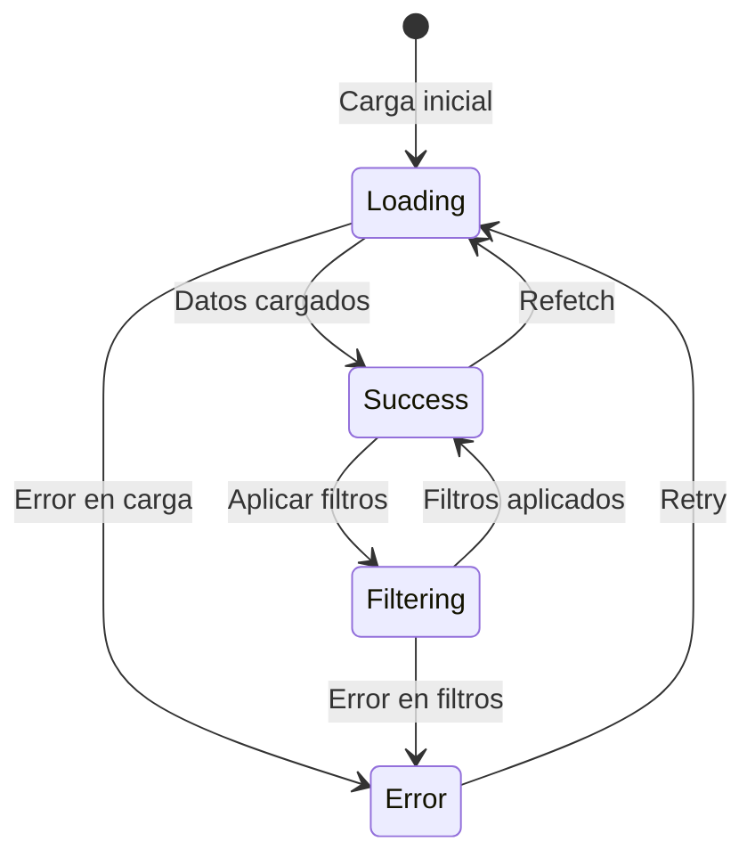
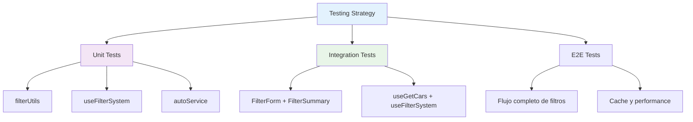
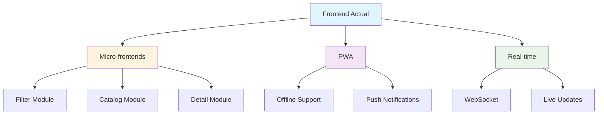

# 🏗️ Sistema de Vehículos - Arquitectura Completa

## 📋 Tabla de Contenidos

1. [Visión General](#visión-general)
2. [Arquitectura del Sistema](#arquitectura-del-sistema)
3. [Flujo de Datos](#flujo-de-datos)
4. [Componentes y Responsabilidades](#componentes-y-responsabilidades)
5. [Sistema de Filtros](#sistema-de-filtros)
6. [Validaciones y Utilidades](#validaciones-y-utilidades)
7. [Cache y Performance](#cache-y-performance)
8. [Estados y Manejo de Errores](#estados-y-manejo-de-errores)
9. [Backend Integration](#backend-integration)
10. [Testing y Debugging](#testing-y-debugging)

---

## 🎯 Visión General

El sistema de vehículos de Indiana Usados es una aplicación React moderna que maneja el catálogo de vehículos con filtros avanzados, cache inteligente y arquitectura escalable.

### **Objetivos del Sistema:**
- ✅ **Performance**: Carga rápida y cache eficiente
- ✅ **UX**: Filtros intuitivos y feedback inmediato
- ✅ **Escalabilidad**: Arquitectura preparada para crecimiento
- ✅ **Mantenibilidad**: Código limpio y bien documentado
- ✅ **Backend Ready**: Preparado para integración real

---

## 🏛️ Arquitectura del Sistema

### **Diagrama de Arquitectura General**



### **Separación de Responsabilidades**

| Capa | Responsabilidad | Componentes |
|------|----------------|-------------|
| **Presentación** | UI y Interacción | FilterForm, FilterSummary, CardAuto |
| **Lógica de Negocio** | Orquestación | useFilterSystem, useGetCars |
| **Servicios** | Datos y API | autoService, filterUtils |
| **Estado** | Gestión de Estado | React Query, Context, Local State |

---

## 🔄 Flujo de Datos

### **Flujo Principal de Filtros**



### **Flujo de Cache y Datos**



---

## 🧩 Componentes y Responsabilidades

### **Jerarquía de Componentes**

```
App
├── FilterContext
│   └── FilterProvider
│       └── useFilterSystem
│           ├── useGetCars
│           ├── useMutation
│           └── useFilterNotifications
├── ListAutos
│   ├── FilterForm
│   │   ├── DropdownMultiCheckbox
│   │   └── Range Sliders
│   ├── FilterSummary
│   ├── AutosGrid
│   └── CardAuto
└── Pages
    ├── Home
    ├── Vehiculos
    └── VehiculoDetalle
```

### **Responsabilidades Detalladas**

| Componente | Responsabilidad | Dependencias | Estado |
|------------|----------------|--------------|--------|
| **FilterForm** | Capturar filtros del usuario | useFilterSystem | Local (React Hook Form) |
| **FilterSummary** | Mostrar filtros activos | pendingFilters | Derivado |
| **ListAutos** | Orquestar componentes | useFilterContext | Local (pendingFilters) |
| **useFilterSystem** | Lógica de filtros | useMutation, useQuery | Global (Context) |
| **useGetCars** | Obtener datos | autoService, React Query | Cache |
| **autoService** | Comunicación API | Mock data / Real API | Stateless |
| **filterUtils** | Utilidades de filtros | - | Stateless |

---

## 🔍 Sistema de Filtros

### **Arquitectura de Filtros**



### **Tipos de Filtros**

| Tipo | Componente | Validación | Backend Mapping |
|------|------------|------------|-----------------|
| **Multi-Select** | DropdownMultiCheckbox | Array no vacío | `brand`, `fuel`, etc. |
| **Range** | Range Slider | Número > 0 | `yearFrom`, `priceTo` |
| **Text** | Input | String no vacío | `model`, `color` |

### **Estados de Filtros**



---

## ✅ Validaciones y Utilidades

### **Sistema de Validación**

```javascript
// Validación centralizada en filterUtils.js
export const isValidFilterValue = (value) => {
    // 1. Excluir valores vacíos
    if (!value || value === '' || value === null || value === undefined) {
        return false
    }
    
    // 2. Excluir valores numéricos 0
    if (typeof value === 'number' && value === 0) {
        return false
    }
    
    // 3. Excluir strings '0'
    if (typeof value === 'string' && value === '0') {
        return false
    }
    
    // 4. Excluir arrays vacíos
    if (Array.isArray(value) && value.length === 0) {
        return false
    }
    
    // 5. Excluir valores por defecto de ranges
    if (typeof value === 'string') {
        const defaults = Object.values(FILTER_DEFAULTS)
        if (defaults.includes(value)) {
            return false
        }
    }
    
    return true
}
```

### **Transformación para Backend**

```javascript
// Mapeo de filtros frontend → backend
export const transformFiltersToBackend = (filters) => {
    const validFilters = getValidFilters(filters)
    const backendFilters = {}
    
    Object.entries(validFilters).forEach(([key, value]) => {
        switch (key) {
            case 'marca':
                backendFilters.brand = value
                break
            case 'añoDesde':
                backendFilters.yearFrom = parseInt(value)
                break
            case 'precioDesde':
                backendFilters.priceFrom = parseInt(value)
                break
            // ... más mapeos
        }
    })
    
    return backendFilters
}
```

### **Filtrado de Vehículos**

```javascript
// Lógica de filtrado centralizada
export const filterVehicles = (vehicles, filters) => {
    if (!vehicles || !Array.isArray(vehicles)) return []
    
    const validFilters = getValidFilters(filters)
    
    if (Object.keys(validFilters).length === 0) {
        return vehicles
    }
    
    return vehicles.filter(vehicle => {
        return Object.entries(validFilters).every(([key, value]) => {
            switch (key) {
                case 'marca':
                    return vehicle.marca?.toLowerCase().includes(value.toLowerCase())
                case 'añoDesde':
                    return vehicle.año >= parseInt(value)
                // ... más casos
            }
        })
    })
}
```

---

## ⚡ Cache y Performance

### **Estrategia de Cache**



### **Configuración de Cache por Query**

| Query Key | Stale Time | Cache Time | Propósito | Invalidación |
|-----------|------------|------------|-----------|--------------|
| `['all-vehicles']` | 1 min | 30 min | Lista completa | Manual |
| `['filtered-vehicles', filters]` | 5 min | 30 min | Resultados filtrados | Automática |
| `['auto', id]` | 5 min | 30 min | Detalle de vehículo | Manual |

### **Optimizaciones de Performance**

1. **Memoización**: `useMemo` para cálculos costosos
2. **Debouncing**: Evitar requests excesivos
3. **Lazy Loading**: Cargar datos solo cuando se necesitan
4. **Cache Inteligente**: Reutilizar datos cuando sea posible

---

## 🎛️ Estados y Manejo de Errores

### **Estados del Sistema**



### **Estados de Carga**

| Estado | Descripción | UI Feedback |
|--------|-------------|-------------|
| `isLoading` | Carga inicial | Spinner |
| `isFiltering` | Aplicando filtros | "Aplicando..." |
| `isFetchingNextPage` | Cargando más | "Cargando más..." |
| `isError` | Error ocurrido | Mensaje de error |

### **Manejo de Errores**

```javascript
// Estrategia de manejo de errores
const errorHandling = {
    // 1. Errores de red
    network: (error) => {
        notifications.showErrorNotification('Error de conexión')
        console.error('Network error:', error)
    },
    
    // 2. Errores de validación
    validation: (error) => {
        notifications.showErrorNotification('Datos inválidos')
        console.error('Validation error:', error)
    },
    
    // 3. Errores del backend
    backend: (error) => {
        notifications.showErrorNotification(`Error del servidor: ${error.message}`)
        console.error('Backend error:', error)
    }
}
```

---

## 🔌 Backend Integration

### **Endpoints Preparados**

```javascript
// Estructura de endpoints (futuro)
const ENDPOINTS = {
    // GET - Lista completa
    getAllVehicles: '/api/vehicles',
    
    // POST - Aplicar filtros
    applyFilters: '/api/vehicles/filter',
    
    // GET - Detalle de vehículo
    getVehicleById: '/api/vehicles/:id',
    
    // GET - Opciones de filtros
    getFilterOptions: '/api/vehicles/filter-options'
}
```

### **Transformación de Payload**

```javascript
// Ejemplo de payload enviado al backend
const backendPayload = {
    // Filtros de marca (array)
    brand: ['Toyota', 'Honda'],
    
    // Filtros de rango
    yearFrom: 2020,
    yearTo: 2024,
    priceFrom: 50000,
    priceTo: 200000,
    
    // Filtros de texto
    model: 'Corolla',
    color: 'Blanco',
    
    // Filtros de selección
    fuel: 'Nafta',
    transmission: 'Automático'
}
```

### **Respuesta del Backend**

```javascript
// Estructura de respuesta esperada
const backendResponse = {
    items: [
        {
            id: 1,
            marca: 'Toyota',
            modelo: 'Corolla',
            año: 2022,
            precio: 75000,
            // ... más campos
        }
    ],
    total: 150,
    filteredCount: 25,
    totalCount: 150,
    filters: {
        // Filtros aplicados
    },
    pagination: {
        currentPage: 1,
        totalPages: 5,
        hasNextPage: true
    }
}
```

---

## 🧪 Testing y Debugging

### **Estrategia de Testing**



### **Funciones de Debug**

```javascript
// Funciones expuestas para debugging
export const debugUtils = {
    // Ver estado actual de filtros
    getCurrentFilters: () => currentFilters,
    
    // Ver filtros pendientes
    getPendingFilters: () => pendingFilters,
    
    // Ver cache de React Query
    getQueryCache: () => queryClient.getQueryCache(),
    
    // Limpiar todo el cache
    clearAllCache: () => queryClient.clear(),
    
    // Simular error
    simulateError: () => {
        throw new Error('Error simulado para testing')
    }
}
```

### **Logs de Desarrollo**

```javascript
// Logs estructurados para debugging
const developmentLogs = {
    // Log de filtros aplicados
    filterApplied: (filters) => {
        console.log('🔍 Filtros aplicados:', filters)
    },
    
    // Log de respuesta del backend
    backendResponse: (response) => {
        console.log('✅ Respuesta del backend:', response)
    },
    
    // Log de cache actualizado
    cacheUpdated: (queryKey, data) => {
        console.log('💾 Cache actualizado:', { queryKey, data })
    },
    
    // Log de error
    error: (error, context) => {
        console.error('❌ Error:', { error, context })
    }
}
```

---

## 📊 Métricas y Monitoreo

### **Métricas de Performance**

| Métrica | Objetivo | Medición |
|---------|----------|----------|
| **Tiempo de carga inicial** | < 2s | React DevTools |
| **Tiempo de filtrado** | < 500ms | Performance API |
| **Tamaño de bundle** | < 500KB | Webpack Bundle Analyzer |
| **Cache hit ratio** | > 80% | React Query DevTools |

### **Monitoreo de Errores**

```javascript
// Sistema de monitoreo de errores
const errorMonitoring = {
    // Capturar errores de React
    captureReactError: (error, errorInfo) => {
        console.error('React Error:', { error, errorInfo })
        // Enviar a servicio de monitoreo
    },
    
    // Capturar errores de API
    captureAPIError: (error, endpoint) => {
        console.error('API Error:', { error, endpoint })
        // Enviar a servicio de monitoreo
    },
    
    // Capturar errores de filtros
    captureFilterError: (error, filters) => {
        console.error('Filter Error:', { error, filters })
        // Enviar a servicio de monitoreo
    }
}
```

---

## 🚀 Roadmap y Mejoras Futuras

### **Próximas Mejoras**

1. **🔍 Búsqueda en tiempo real**
   - Implementar debounced search
   - Filtros dinámicos

2. **📱 Optimización mobile**
   - Virtual scrolling para listas grandes
   - Gestos táctiles para filtros

3. **🎨 UI/UX mejoras**
   - Animaciones suaves
   - Skeleton loading
   - Empty states

4. **⚡ Performance**
   - Code splitting
   - Lazy loading de componentes
   - Service workers para cache

5. **🔧 Backend integration**
   - Endpoints reales
   - Autenticación
   - Rate limiting

### **Arquitectura Futura**



---

## 📝 Conclusión

El sistema de vehículos de Indiana Usados está diseñado con una arquitectura moderna, escalable y mantenible. La separación clara de responsabilidades, el sistema de cache inteligente y las utilidades centralizadas hacen que el código sea profesional y eficiente.

### **✅ Logros del Sistema:**

- **Arquitectura limpia** con separación de responsabilidades
- **Performance optimizada** con cache inteligente
- **UX excelente** con feedback inmediato
- **Código mantenible** con utilidades centralizadas
- **Backend ready** para integración real
- **Testing preparado** para cobertura completa

### **🎯 Próximos Pasos:**

1. Implementar tests unitarios e integración
2. Integrar con backend real
3. Optimizar performance mobile
4. Agregar analytics y monitoreo
5. Implementar PWA features

---

*Documentación generada automáticamente - Indiana Usados v2.0.0* 